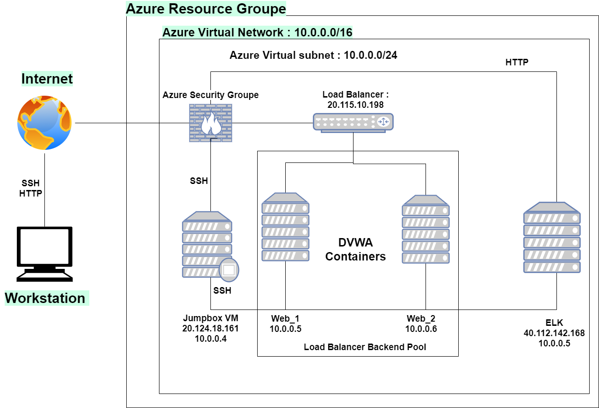

## Automated ELK Stack Deployment

The files in this repository were used to configure the network depicted below.

These files have been tested and used to generate a live ELK deployment on Azure. They can be used to either recreate the entire deployment pictured above. Alternatively, select portions of the _____ file may be used to install only certain pieces of it, such as Filebeat.

  - _TODO: Enter the playbook file._

This document contains the following details:
- Description of the Topologu
- Access Policies
- ELK Configuration
  - Beats in Use
  - Machines Being Monitored
- How to Use the Ansible Build

### Description of the Topology

The main purpose of this network is to expose a load-balanced and monitored instance of DVWA, the D*mn Vulnerable Web Application.

Load balancing ensures that the application will be highly responsive, in addition to restricting trafic to the network.
- Load balancers maintains the Availability of data in the CIA triad of security as it protects the network system against
potential DDoS attacks by distributing traffic across multiple servers. The advantage of a jump box is the security architecture
it provides, by controlling access to other machines by allowing connections from specific IP adresses, acting similar to 
a gateway router as an origination point to connect to other servers.

Integrating an ELK server allows users to easily monitor the vulnerable VMs for changes to the _____ and system _____.
- Filebeats watches for changes in the file system
- Metricbeat records machine metric data and statistics, such as uptime.

The configuration details of each machine may be found below.

| Name             | Function | IP Address | Operating System |
|------------------|----------|------------|------------------|
|JumpBoxProvisioner| Gateway  | 10.0.0.1   | Linux            |
| web-1            | webserver| 10.0.0.5   | Linux            |
| web-2            | webserver| 10.0.0.6   | Linux            |
| Elk VM           | ELK      | 10.1.0.4   | Linux            |

### Access Policies

The machines on the internal network are not exposed to the public Internet. 

Only the JumpBox machine can accept connections from the Internet. Access to this machine is only allowed from the following IP addresses: 216.58.81.80

Machines within the network can only be accessed by _SSH _.
- Jump Box is the only machine allowed access to the ELK VM by using a public Ip : 40.112.142.168

A summary of the access policies in place can be found in the table below.

| Name              | Publicly Accessible | Allowed IP Addresses |
|-------------------|---------------------|----------------------|
| JumpBoxProvisioner| No                  | 20.127.130.6   |
| web-1             | No                  | 10.0.0.5             |
| web-2             | No                  | 10.0.0.6             |
| Elk VM            | No                  | 10.1.0.4             |

### Elk Configuration

Ansible was used to automate configuration of the ELK machine. No configuration was performed manually, which is advantageous because...
- automatically configuring files with Ansible allows users to deploy mutilple servers using a single playbook (IaC)

The playbook implements the following tasks:
- Install docker.io and python-pip apt packages
- Install python-pip package
- Downloads docker container sebp/elk:761
- Download and launch docker elk container

The following screenshot displays the result of running `docker ps` after successfully configuring the ELK instance.

### Target Machines & Beats
This ELK server is configured to monitor the following machines:
- 10.0.0.5
- 10.0.0.6

We have installed the following Beats on these machines:
- Filebeat and Metricbeat

These Beats allow us to collect the following information from each machine:
- Metricbeat periodically collects metrics from systems and services where you can find top-like statistics for every process running

### Using the Playbook
In order to use the playbook, you will need to have an Ansible control node already configured. Assuming you have such a control node provisioned: 

SSH into the control node and follow the steps below:
- Copy the filebeatconfig.yml file to /etc/ansible/files/.
- Update the /etc/ansible/host file to include groupded private IP address of webservers separate from the private IP address of the the ELK VM
- Run the playbook, and navigate to http://104.42.47.109:5601/app/kibana  to check that the installation worked as expected.

_TODO: Answer the following questions to fill in the blanks:_
- Which file is the playbook? Where do you copy it? /etc/ansible/files/filebeat-playbook
- _Which file do you update to make Ansible run the playbook on a specific machine? How do I specify which machine to install the ELK server on versus which to install Filebeat on?_
- _Which URL do you navigate to in order to check that the ELK server is running?
    http://104.42.47.109:5601/app/kibana

_As a **Bonus**, provide the specific commands the user will need to run to download the playbook, update the files, etc._